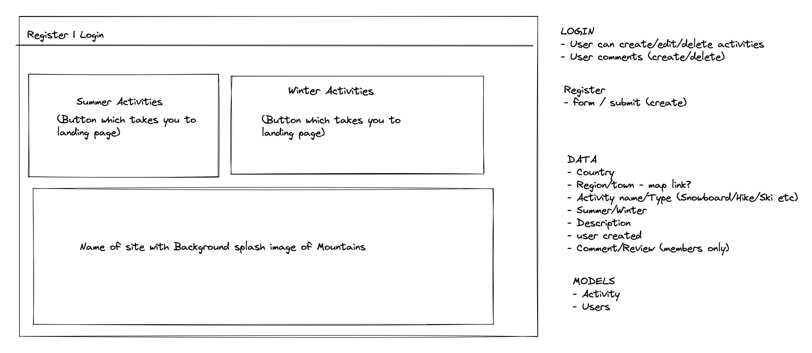
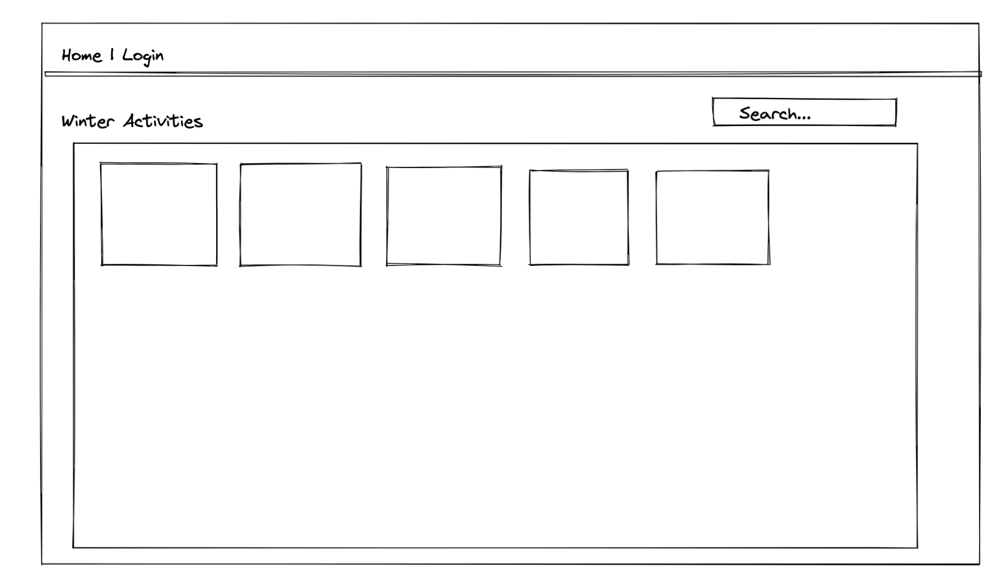
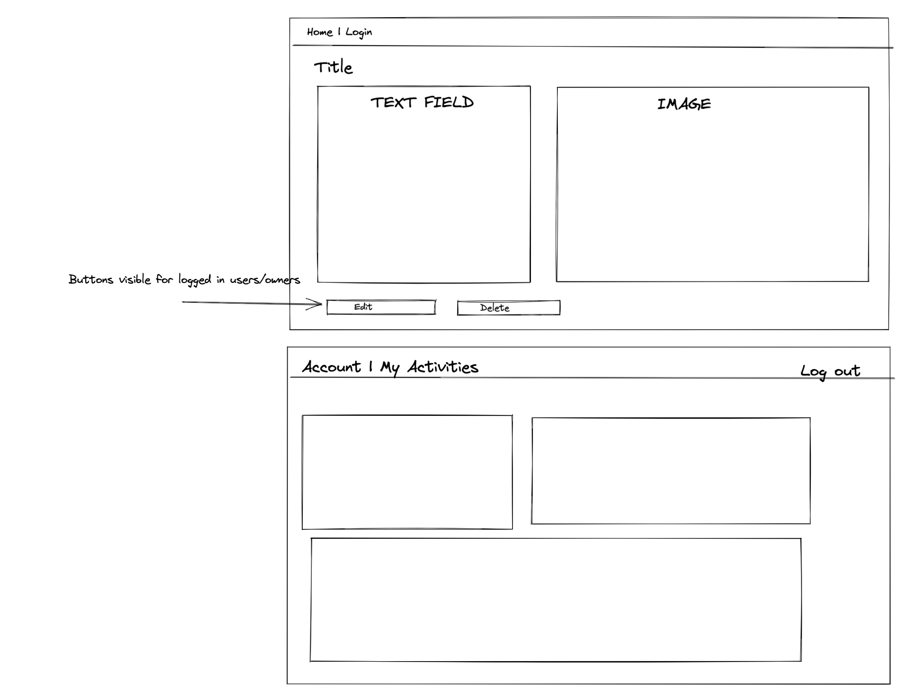
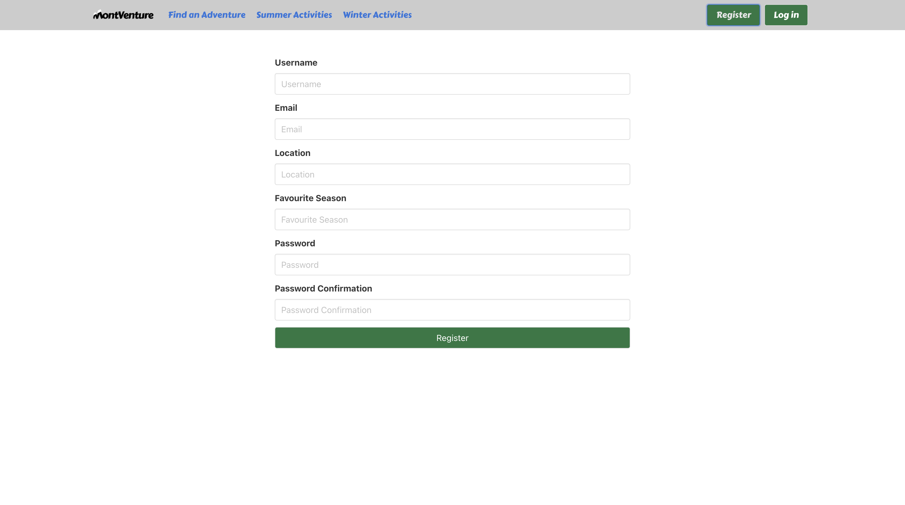
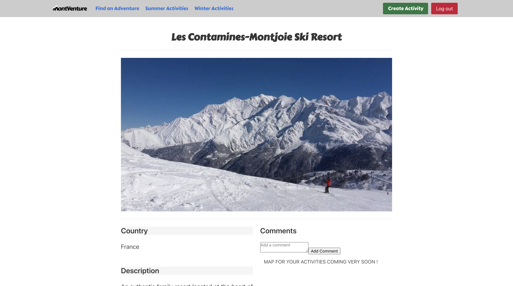

#  Project 3: MontVenture

by [Drew Lamph](https://github.com/dlamph), [Theo Wyzgowski](https://github.com/tdore92) and [Raphaëlle Charrier](https://github.com/RaphaelleC).

[Link to the client repository](https://github.com/RaphaelleC/project-3-client).

MontVenture is an app for all nature enjoyers to publish their favourite spots for hiking, cycling, snowboarding and more.<br>
This is the first project where I have had to create a server connected to a client. It was also the first time I used Git with a group (merging, resolving conflicts).


## Contents

- [Project Brief](#project-brief)
- [Approach](#approach)
- [Technologies](#technologies-used)
- [Responsibilities](#responsibilities)
- [Achievements](#achievements)
- [Challenges](#challenges)
- [Key Learnings and Conclusion](#key-learnings-and-conclusion)

## Project Brief

* **Build a full-stack application** by making your own backend and your own front-end
* **Use an Express API** to serve your data from a Mongo database
* **Consume your API with a separate front-end** built with React
* **Be a complete product** which most likely means multiple relationships and CRUD functionality for at least a couple of models
* **Implement thoughtful user stories/wireframes** that are significant enough to help you know which features are core MVP and which you can cut
* **Have a visually impressive design** to kick your portfolio up a notch and have something to wow future clients & employers. **ALLOW** time for this
* **Be deployed online** so it's publicly accessible

## Approach

We started by designed a quick flowchart of our website. Being able to see how our app was going to look like helped us defining everything we needed to implement in the back end.

Here are our flowcharts:





We divided the workload into tasks that were first independent to each other, and we then brought them all together. We decided depending on if someone had any preference on a particular task, or felt more comfortable with something, or the opposite : if someone is not yet comfortable with a task or technology but want to take the opportunity to learn more about it during this project.

We've kept a great communication during our project time, be it via video calls or through Slack. That way, everyone knew what to do and we were all helping each other when facing issues and debugging.

## Technologies

### <ins>Back-end</ins>

* Node.js
* MongoDB
* Express

### <ins>Front-end</ins>

<br>
<br>


#### Additional technologies:

* SASS
* Bulma
* Axios
* Cloudinary

## Responsibilities

### Back end

#### User seeding

I seeded the base users with mongoose and express.

User example :
```js
{
  email: 'raph@email',
  username: 'Raph',
  location: 'United Kingdom',
  favSeason: 'Winter',
  password: '****',
  passwordConfirmation: '****',
}
```
The seeding function :
```js
async function seedDatabase() {
  try {
    await connectToDb()
    console.log('Successfully connected to mongo !')

    await mongoose.connection.db.dropDatabase()
    console.log('Removed all the activities !')

    const users = await User.create(userData)
    console.log(`${users.length} user(s) created !`)
    console.log(users)

    (...)

    await mongoose.connection.close()
    console.log('Disconnected from mongo. All done !')

  } catch (err) {
    console.log('Something went wrong :(')
    await mongoose.connection.close()
  }
}
```

First, I need to connect to Mongo and remove all the data so there is no confilct when creating these users. Then I can create the users and seed them in the database newly built.

I used a `console.log()` message for each step so that, if there is an error, I can see which step went wrong and debug it.

#### User controllers

I created the register and login controllers so our users could have an account and post their favourites destinations on our website.

Register controller :
```javascript
async function register(req, res, next) {
  try {
    const user = await User.create(req.body)
    res.status(201).json(user)
  } catch (e) {
    next(e)
  }
}
```
This controller takes the data from the user input and uses it to create and store a new user in our database.

Login controller :
```javascript
async function login(req, res, next) {
  try {
    const user = await User.findOne({ email: req.body.email })

    if (!user) {
      throw new NotValid('There was a problem logging in')
    }
    const isValidPw = user.validatePassword(req.body.password)
    if (!isValidPw) {
      throw new NotValid('There was a problem logging in')
    }

    const token = jwt.sign(
      { sub: user._id },
      secret,
      { expiresIn: '12h' }
    )

    console.log('Success!')
    res.status(202).json({ message: 'Login successful', token })

  } catch (e) {
    next(e)
  }
}
```

This controller first checks if the email address entered by the user exists in our database, and throws an error if not. It then verifies if the password is valid (if it matches the user email address), and also throws an error if not. When both these two informations are correct, a token is allocated to the user and they are now logged in our website.

### Front end

#### Forms

##### Register and Login

I took care of the registration and login forms, using the `useHistory()` from `react-router-dom` to direct users to the login page after registration, and to the home page after they are logged in.

For the register form :
```js
const history = useHistory()
  const { formdata, formErrors, handleChange, setFormErrors } = useForm({
    username: '',
    email: '',
    location: '',
    favSeason: '',
    password: '',
    passwordConfirmation: '',
  })

  const handleSubmit = async (e) => {
    e.preventDefault()

    try {
      await registerUser(formdata)
      history.push('/login')
    } catch (err) {
      setFormErrors(err.response.data.errors)
    }
  }
```
It waits for the user to enter data in the form. When they click the `Submit` button, the `handleSubmit` function takes effect and sends the data to the database. If there is a field missing, it will show an error to the user, indicating what and where the problem is.

For the login form :
```js
const history = useHistory()
const [isError, setIsError] = React.useState(false)
const { formdata, handleChange } = useForm({
  email: '',
  password: '',
})

const handleSubmit = async (e) => {
  e.preventDefault()

  try {
    const res = await loginUser(formdata)
    setToken(res.data.token)
    history.push('/')
  } catch (err) {
    setIsError(true)
  }
}
```
The login form takes the email and password the user enter, send it to the back end to check that the data is correct, then set up a token for the user that is now logged in. If the email or password is incorrect, it will show an error for the user to see.

##### Edit activity

I also took created the edit form of our app. We implemented it so our users can update the different activities they created, be it because they made a mistake when creating it or because it changed compared to their previous experience.<br>
I have used `useHistory()` again to redirect the user to the activity page after editing it.

```js
React.useEffect(() => {
    const getData = async () => {
      try {
        const res = await getSingleActivity(activityId)
        setFormdata(res.data)
      } catch (e) {
        setFormErrors(e.response.data.errors)
      }
    }
    getData()
  }, [activityId, setFormdata, setFormErrors])

  const handleSubmit = async (e) => {
    e.preventDefault()

    try {
      const { data } = await editActivity(activityId, formdata)
      history.push(`/activities/${data._id}`)
    } catch (e) {
      setFormErrors(e.response.data.errors)
    }
  }
```
This form get the data that has been stored in our database when the activity was created to show it on the form, so the user can simply modify what he wants. When the modifications are done, the new data is sent to the database and we redirect the user to the activity page so he can checks that the activity has the correct description, picture, location, etc. If there are any errors, it will show them to the user.

#### Styling



Using the Bulma library and CSS, I styled the navigation bar, the register and login forms, as well as the activity pages. We wanted to keep the styling simple so it could better highlight the pictures of the activities.



## Achievements

Creating MontVenture has been quite a challenge but also very rewarding. I'm very proud of this project as my first full stack app, and with how I handled the multiple forms I have created in particular. I feel like I really understand how the back end and the database connect to the front end, which is a key in building these forms that either send data or get data to the database via the back end.

## Challenges

When we were working on the front end of our app, we realised that we needed to modify our activities data. We needed to change what we called `name` by `activityName` for more clarity. But in doing so, we also had to adjust our front end files accordingly, which took a bit of time. This really made us aware that a little change in the back end implies that we have to spend more time doing changes, time that could be used elsewhere. We will pay more attention to this in future projects.<br>

## Key Learnings and Conclusion

* Time management : this project help me put into perspective how much time certain tasks need to be complete, and thus confirmed that planning up ahead and trying to estimate the time allocated for each step is important.
* Improvement of my Mongo, Express and React skills : to put these three technologies into practice in a concrete project helped me understand how they work together, how to link them to each other to create a functional app.
* Team work and communication : as in my previous project, we kept a great communication between us, which I felt was very important because it helped us managing our time and making clear who is working on which task, if we're struggling with it or not. We've been able to help and support each other well.
* Github usage (commit, pull, merge, resolve conflicts, push)

This project helped me better understand the relationships between the front end and the back end of an app. It also taught me that planning up ahead is really important : making changes on the back end after starting coding the front end is not always easy, we can end up losing time updating things that we thought were done.<br>
It also showed me that time management and making a list of priorities is really important. One of our stretch goals was to implement Mapbox on our app so when a user creates an activity, he could locate it on a map and it would show the location of the activity on its page. We didn't implement that though, as we didn't have enough time left and preferred to focus on refactoring, testing and making sure our app was working properly.

## Bugs

There is a bug left on our app which we didn't have time to fix : when a user posts a comment, it is posted twice instead of once.